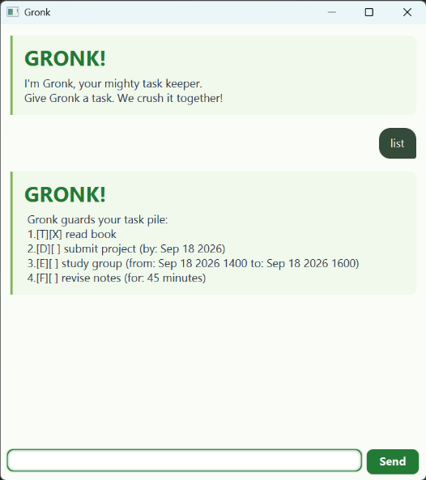

# Gronk User Guide

Gronk is your mighty task keeper: track tasks, plan deadlines and events,
estimate effort, and mark work done. Tasks stay on your computer and are saved
automatically after each successful change.



*A typical study week in Gronk: all four task types, completed work, and a keyword
search ready to run.*

## Quick start

**Release status:** The updated GUI JAR is awaiting publication. The current
GitHub release contains the earlier console version. Until the new release is
available, [build Gronk from source](https://github.com/aston-ish/ip#build-and-verify)
to use the interface shown above.

1. Install **Java 25**. Run `java -version` in a terminal to check your version.
2. For now, build from source using the link above and copy `build/libs/topaz.jar`.
   Once the GUI release is published, you can download `topaz.jar` from the
   [latest release](https://github.com/aston-ish/ip/releases/latest) instead.
   The filename is retained from earlier versions; the application is **Gronk**.
3. Put the JAR in a writable folder. Open a terminal in that folder and run:

   ```text
   java -jar topaz.jar
   ```

4. Type `todo read book` and press **Enter** or click **Send**.
5. Type `list` to see your tasks, then `mark 1` to complete the first task.

Resize the window as needed. Scroll up to read earlier replies; new replies
scroll into view automatically. Errors have red cards and an **ERROR** heading.
Correct the command and try again.

## Commands

Replace text in angle brackets with your values; do not type the brackets.
Use lowercase command words and enter one command at a time. Leading/trailing
spaces, repeated spaces, and tabs are accepted. Descriptions can contain spaces.

| Action | Format | Example |
| --- | --- | --- |
| Add a to-do | `todo <description>` | `todo buy milk` |
| Add a deadline | `deadline <description> /by <date or time>` | `deadline return book /by 2026-12-07` |
| Add an event | `event <description> /from <start> /to <end>` | `event study /from 8/12/2026 1400 /to 8/12/2026 1600` |
| Estimate effort | `duration <description> /for <duration>` | `duration revise notes /for 45m` |
| Show all tasks | `list` | `list` |
| Search | `find <text>` | `find book` |
| Mark done | `mark <number>` | `mark 2` |
| Mark not done | `unmark <number>` | `unmark 2` |
| Delete | `delete <number>` | `delete 2` |
| End the session | `bye` | `bye` |

### Add tasks

**To-dos** have no date. `todo buy milk` adds `[T][ ] buy milk`.

**Deadlines** have a due date or time:

```text
deadline return book /by 2026-12-07
```

The task is shown as `[D][ ] return book (by: Dec 07 2026)`.

**Events** have a start and end:

```text
event study /from 8/12/2026 1400 /to 8/12/2026 1600
```

The task is shown as `[E][ ] study (from: Dec 08 2026 1400 to: Dec 08 2026 1600)`.
The end must be strictly later than the start. Date-only endpoints are accepted,
for example `event holiday /from 2026-12-07 /to 2026-12-09`.

**Fixed-duration tasks** estimate effort without scheduling a start or end.
`duration revise notes /for 2h` adds `[F][ ] revise notes (for: 2 hours)`.
Use a positive whole number with `h` for hours or `m` for minutes: `1h`, `45m`, `90m`.
Decimals, zero, negative values, mixed units such as `1h30m`, and excessively large
values are rejected. Use `90m` instead of `1h30m`. Exact multiples of 60 minutes
are displayed as hours.

### Dates and times

| Input | Meaning |
| --- | --- |
| `2026-12-07` | December 7, 2026; midnight for event comparisons |
| `7/12/2026 1430` | December 7, 2026 at 2:30 pm, using a 24-hour clock |
| `2026-12-07T14:30` | The same time in ISO local date-time format |

Use four-digit years and real dates. `2026-02-30` and times such as `2460` are
rejected. Times are local, without time-zone suffixes. The display shows hours
and minutes; any ISO seconds supplied are saved but not displayed.

### List and search

`list` shows tasks in insertion order. `[ ]` means incomplete and `[X]` means
done. Types are `[T]` to-do, `[D]` deadline, `[E]` event, and `[F]` fixed duration.
An empty list suggests a command to add your first task.

`find book` matches displayed descriptions containing `book`, ignoring letter
case. A multiword query is matched as one phrase. Displayed dates and durations
are searchable too, for example `find Dec` and `find hours`. No matches produces
an explicit message and does not change the list.

**Search results keep full-list numbers.** If task 1 is `buy milk` and task 2 is
`read book`, `find book` shows task **2**. Use `mark 2` to complete it. Search does
not create a separate task list.

### Mark, unmark, and delete

`mark 2` changes task 2 to `[X]`; `unmark 2` changes it back to `[ ]`. Repeating
either command is safe. Numbers start at **1** and must refer to an existing task.
Missing, non-numeric, zero, negative, and out-of-range numbers are rejected.

`delete 2` permanently removes task 2. Later tasks shift up by one number, so use
`list` again to see current numbers. There is no undo: add the task again or
restore a backup if you delete it by mistake.

### Exit

`bye` shows a farewell and disables the input box and Send button. Close the
window to exit. Relaunch for a new session. You can also close the window at any
time: successful changes have already been saved.

## Common input errors

- Descriptions, dates, durations, and search text cannot be empty.
- Use `/by` once, `/from` then `/to` once each, or `/for` once, with spaces around
  each marker. In structured commands, slash-prefixed words are reserved for
  parameters. Unknown, repeated, or out-of-order parameters are rejected.
- Task details cannot contain the `|` save-file delimiter or control characters.
- `list` and `bye` take no arguments. Unknown command words are rejected.
- Duplicates are rejected, even if the existing task is done. Comparison ignores
  description case and repeated spaces, and checks the type and schedule.
  `1h` and `60m` are the same duration. Different types or schedules are allowed.

Invalid commands leave tasks unchanged. Read the error card for the expected
format and submit a corrected command.

## Saving and recovery

Tasks are stored in **`data/Topaz.txt` relative to the folder you launched from**.
The legacy name preserves compatibility with older versions. Launch from the
same folder each time. A missing file starts an empty list; the folder and file
are created on the first successful change. If tasks seem missing, check the
launch folder before adding new tasks.

To back up, close Gronk and copy `data/Topaz.txt` somewhere safe. To restore, close
Gronk and replace it with the backup. Run only one instance per save file;
simultaneous sessions do not merge changes.

A corrupt file produces an error identifying the bad line and remains unchanged.
Restore a backup or repair that line in a UTF-8 text editor, then submit `list` in
the GUI to retry loading. Restart the CLI after repairing a load error.

A failed save rolls back the command and keeps the previous saved list. Check
write permissions, free disk space, and file locks, then retry. Use a writable
local folder supporting atomic file replacement. Save targets must be regular
files; read-only files and symbolic links are not replaced.

To choose a different save file:

```text
java -Dtopaz.dataFile=data/my-tasks.txt -jar topaz.jar
```

For a path with spaces, quote the whole option, for example
`java "-Dtopaz.dataFile=C:/My Tasks/tasks.txt" -jar topaz.jar`.

## Launch troubleshooting

- **Unable to access jarfile:** open a terminal in the JAR's folder or give its full path.
- **UnsupportedClassVersionError:** run `java -version` and select Java 25.
- **JavaFX runtime components are missing:** use the fat JAR produced by
  Gradle's `shadowJar` task (or the GUI release JAR when available). From source,
  run `topaz.ui.Launcher` or Gradle's `run` task.
- **Native library/graphics error:** bundled JavaFX targets Windows, Linux, and
  macOS on x64. Other CPU architectures need a matching JavaFX runtime/build.
  Linux GUI sessions also need a graphical display.

For the optional console interface, run `java -cp topaz.jar topaz.Topaz`.
It uses the same commands and save file; `bye` exits immediately.
